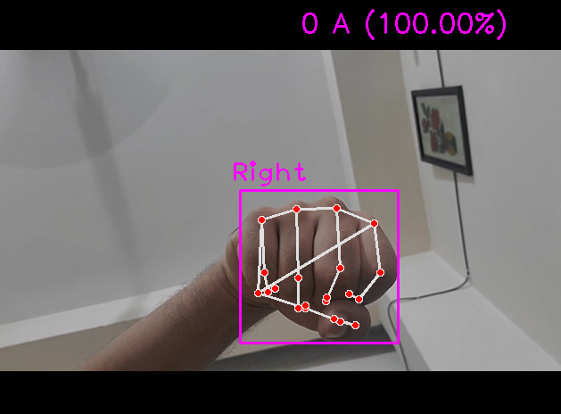

# Realtime ASL Detection with Computer Vision

This project demonstrates **real-time American Sign Language (ASL) detection** using a webcam, OpenCV, and models trained via [Teachable Machine](https://teachablemachine.withgoogle.com/train/image). It's currently trained for the letters **A, B, and C**, but can be extended to support A–Z.

> ✅ **Supports both left and right hands** — the sample images included (`A.png`, `B.png`, `C.png`) represent different hand orientations.

---

## 📁 Project Structure

```
.
├── Data/                  # Collected training images (A, B, C folders)
├── Model/                 # Trained model files
│   ├── keras_model.h5
│   ├── labels.txt
│   └── model_unquant.tflite
├── A.png                  # Sample test image for A
├── B.png                  # Sample test image for B
├── C.png                  # Sample test image for C
├── ASL.png                # Full ASL alphabet chart
├── dataCollection.py      # Script to collect training data
├── main.py                # Script to run the real-time detection
```

---

## 🚀 Getting Started

### 1. Clone the Repository

```bash
git clone https://github.com/Arefin994/Realtime-ASL-Detection-with-CV.git
cd Realtime-ASL-Detection-with-CV
```

### 2. Install Dependencies

```bash
pip install tensorflow==2.19.0
pip install mediapipe==0.10.21
pip install opencv-python==4.11.0.86
pip install cvzone==1.6.1
pip install numpy==1.26.4
```

---

## 📹 Data Collection

To collect your own ASL data:

```bash
python dataCollection.py
```

Images will be saved under the `Data/` folder organized by label.

---

## 🧠 Model Training

Use [Teachable Machine](https://teachablemachine.withgoogle.com/train/image):

1. Upload the collected images.
2. Train your model.
3. Download the model (Keras format).
4. Place `keras_model.h5`, `labels.txt`, and `model_unquant.tflite` into the `Model/` directory.

> **Want ready-to-use data?**
> Check out the official dataset here: [ASL-Dataset-By-Arefin](https://github.com/Arefin994/ASL-Dataset-By-Arefin). You can also update or expand the dataset as needed.

---

## 🎯 Run Realtime Detection

Once the model is ready, run:

```bash
python main.py
```

Your webcam will open, and the model will try to predict your hand gesture in real time.

---

## 🗃️ Sample Images

### ASL Full Chart


### A



### B


### C


---

## 🙋 Support

For any issues or suggestions:

* Email: **[arefinamin994@gmail.com](mailto:arefinamin994@gmail.com)**
* Facebook: [facebook.com/arefin.amin.994](https://www.facebook.com/arefin.amin.994/)

---

## 🚧 Contributing

Feel free to **fork**, enhance, or extend the repository. Pull requests are welcome — help expand support from A–Z or improve the model pipeline.

---
